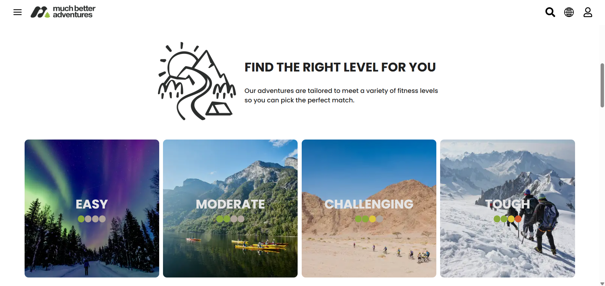
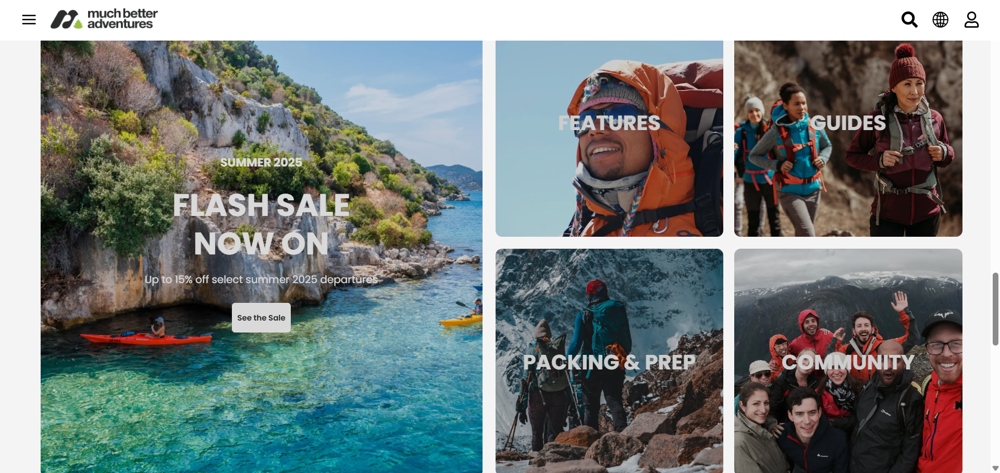
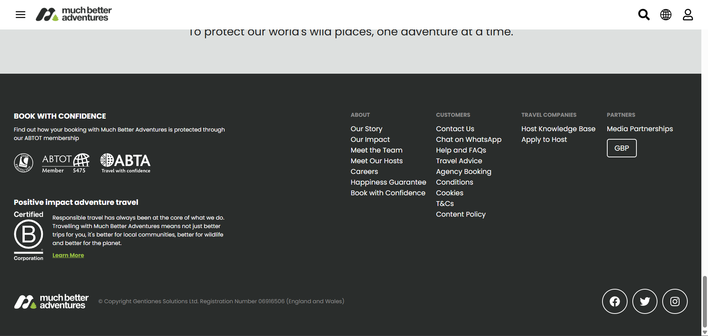

# 🌍 Much Better Adventures - Home Page Clone

This project is a **clone** of the [Much Better Adventures](https://www.muchbetteradventures.com/) **homepage**, created to enhance my **React.js** development skills — especially in building **reusable components**, managing layouts, and creating **responsive** UIs.

---

## 📸 Screenshots

| Preview 1 | Preview 2 |
|------------|------------|
|  |  |

| Preview 3 | Preview 4 |
|------------|------------|
|  |  |

---

## 🌐 Live Demo

Check out the live version here:  
👉 **[React-UI-Practice Live Demo](https://react-ui-practice-nine.vercel.app/)**  

Official Website:  
🌎 **[Much Better Adventures](https://www.muchbetteradventures.com/)**  

---

## ⚙️ Tech Stack

- ⚛️ **React.js** – Component-based UI development  
- 🎨 **CSS** – Responsive and modern design  
- 🔣 **React Icons** – For clean and expressive visuals  

---

## ✨ Features

✅ Fully responsive and mobile-friendly design  
✅ Reusable and modular React components  
✅ Clean and modern UI layout  
✅ Integration of **React Icons** for enhanced aesthetics  

---

## 💡 Why I Built This

I created this project to **practice React.js concepts** and strengthen my front-end development skills.  
The main goals were:
- Understanding **component-based architecture**
- Improving **layout and styling** with CSS
- Learning how to **structure and organize** a React project efficiently

---

## 🛠️ Installation & Setup

Follow these steps to run the project locally:
1⃣ Clone the repository:

```bash
git clone https://github.com/TonyStark-19/react-ui-practice.git
```

2⃣ Navigate to the project directory:

```bash
cd react-ui-practice
```

3⃣ Install dependencies:

```bash
npm install
```

4⃣ Run the development server:

```bash
npm start
```

---

## 📩 Feedback

If you have any suggestions or feedback, feel free to reach out! 🚀
