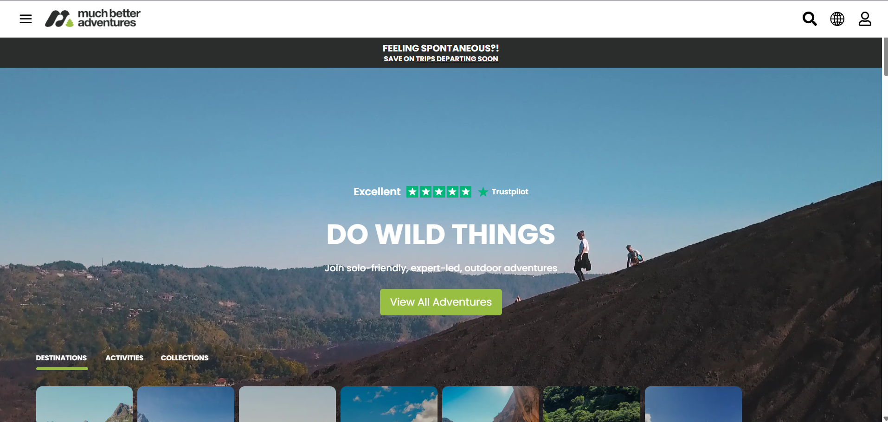

# Much Better Adventures - Home Page Clone

This project is a **clone** of the Much Better Adventures homepage, created to practice and strengthen my **React.js** skills, particularly around building and using **components**.

---

## 📸 Screenshot



---

## 🚀 Live Demo

Check out the live version of the project here: [React-UI-practice](https://react-ui-practice-nine.vercel.app/)

---

## 🚀 Tech Stack
- **React.js**
- **CSS**
- **React Icons**

---

## 🎯 Features
- Fully responsive design
- Use of reusable React components
- Modern and clean UI
- Integrated **React Icons** for a more appealing look

---

## 📚 Why I Built This
I built this project as a way to **practice React.js** concepts, especially focusing on **breaking the UI into components** and making the page **responsive** using CSS.

---

## 🛠️ Installation and Setup

1⃣ Clone the repository:

```bash
git clone https://github.com/TonyStark-19/filterable-product-table.git
```

2⃣ Navigate to the project directory:

```bash
cd muchbetteradventures-clone
```

3⃣ Install dependencies:

```bash
npm install
```

4⃣ Run the development server:

```bash
npm start
```

The app will be running on `http://localhost:3000`

---

## 📩 Feedback

If you have any suggestions or feedback, feel free to reach out! 🚀
